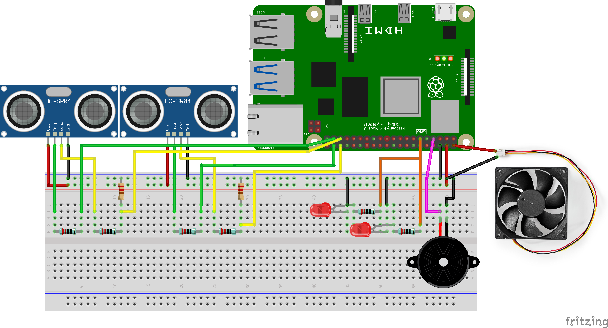
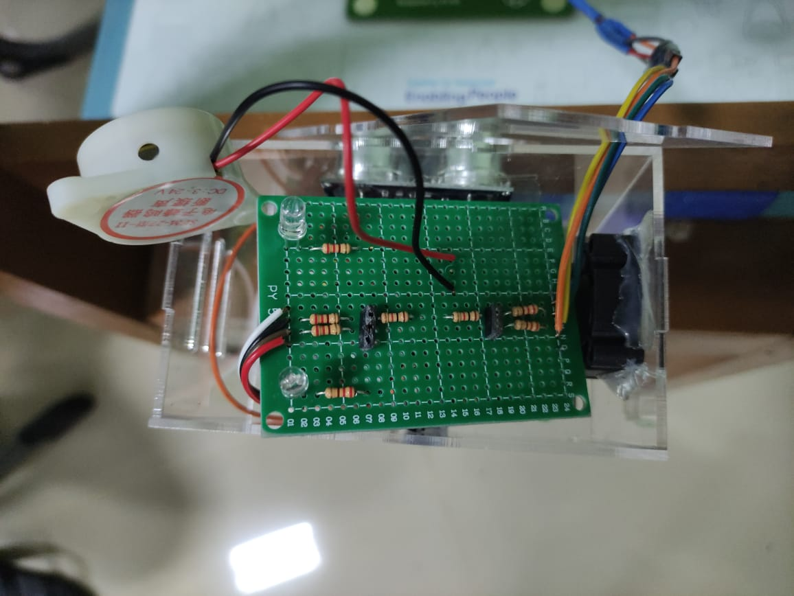
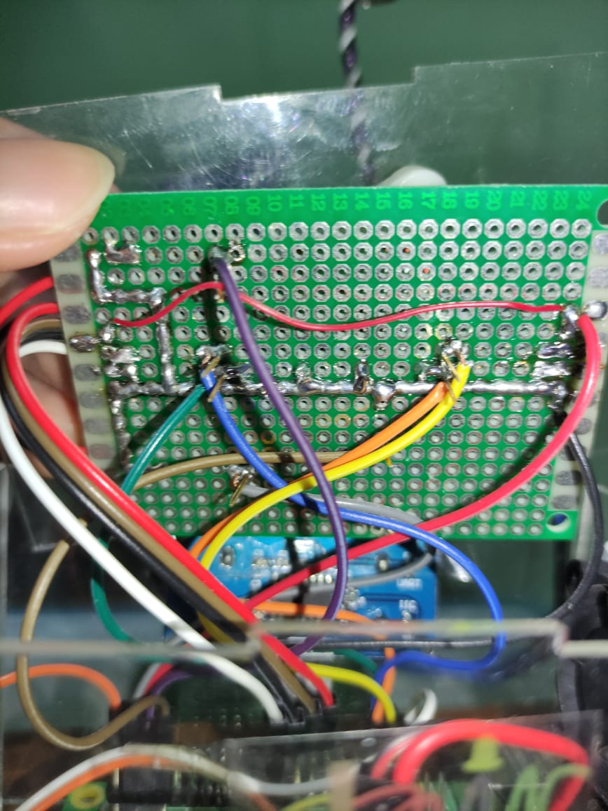

# Chairiot 🪑

  

## 📖 Overview

- **Chairiot** adalah kursi pintar yang dikembangkan oleh tim 24 Hyperion dalam bootcamp SIC Batch 4 yang diadakan oleh samsung dan skilvul. Kursi ini menggunakan 2 sensor ultrasonic yang berguna untuk mendeteksi jarak kursi ke punggung dan pinggang pengguna.
- **Chairiot** dibuat dengan tujuan untuk mengurangi masalah yang disebabkan oleh kesalahan dalam posisi duduk.

## ❓ What Can Chairiot Do?

- Mendeteksi kesalahan duduk pengguna dan memberikan peringatan dari buzzer.
- Memberi reminder ketika pengguna terlalu lama duduk.
- Weekly report berupa laporan seberapa lama pengguna duduk, ringkasan kebiasaan duduk selama seminggu terakhir dan perkembangan kebiasaan duduk dari minggu yang lalu yang dikirim melalui telegram.
- Memiliki 3 Mode yaitu Peaceful, Normal, dan Agressive.
- Dashboard Ubidots untuk menambahkan bot Chairiot dan ID telegram.

## ⚡️ Wiring

  

  

  

